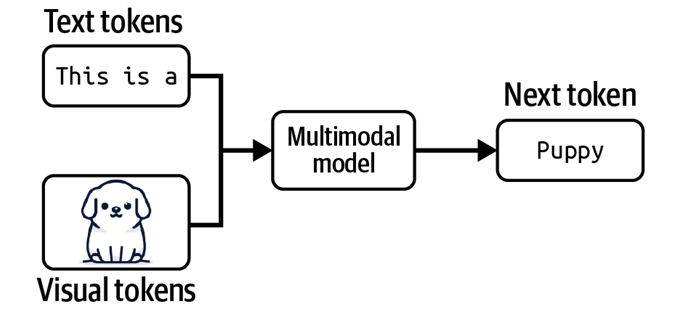

### 1. Foundation Models
- Large Deep Learning Neural Networks trained on massive datasets. 
- data scientists use a foundation model as a starting point to develop ML models.
- before FMs: traditional ML models for specific tasks such as sentiment analysis, classifying images, forecasting trends. 
- Example Use Cases:
    - Customer Support
    - Language Translation
    - Content Generation
    - Copy Writing
    - Image Classification
    - High-resolution image creation and editing
    - Document Extraction
    - Robotics
    - Healthcare
    - Autonomous Vehicles

### 2. BERT
Released in 2018, Bidirectional Encoder Representations from Transformers (BERT) was one of the first foundation models. BERT is a bidirectional model that analyzes the context of a complete sequence then makes a prediction. It was trained on a plain text corpus and Wikipedia using 3.3 billion tokens (words) almost 16 GB training dataset and 340 million parameters. BERT can answer questions, predict sentences, and translate texts. According to OpenAI, the computational power required for foundation modeling has doubled every 3.4 months since 2012. 

### 3. GPT  
The Generative Pre-trained Transformer (GPT) model was developed by OpenAI in 2018. It uses a 12-layer transformer decoder with a self-attention mechanism. And it was trained on the BookCorpus dataset, which holds over 11,000 free novels. `A notable feature of GPT-1 is the ability to do zero-shot learning`.

GPT-2 released in 2019. OpenAI trained it using 1.5 billion parameters (compared to the 117 million parameters used on GPT-1). GPT-3 has a 96-layer neural network and 175 billion parameters and is trained using the 500-billion-word Common Crawl dataset. The popular ChatGPT chatbot is based on GPT-3.5. And GPT-4, the latest version, launched in late 2022 and successfully passed the Uniform Bar Examination with a score of 297 (76%).

### 4. How Foundational Models Work
Models are based on complex neural networks including generative adversarial networks (GANs), transformers, and variational encoders. In general, an FM uses learned patterns and relationships to predict the next item in a sequence. For example, with image generation, the model analyzes the image and creates a sharper, more clearly defined version of the image. Similarly, with text, the model predicts the next word in a string of text based on the previous words and its context. It then selects the next word using probability distribution techniques.

Foundation models use self-supervised learning to create labels from input data. This means no one has instructed or trained the model with labeled training data sets. This feature separates LLMs from previous ML architectures, which use supervised or unsupervised learning.

### 5. Examples of Foundation Models
- BERT
- GPT
- Amazon Nova
- A121 Jurassic

### 6. Language Model: Task Specific
A language model is a probabilistic model trained to predict the next token (usually a word or subword unit) given a sequence of previous tokens. Traditional examples include n-gram models, RNNs, and transformer-based models like GPT. They are trained on textual data and are used in applications such as autocomplete, machine translation, and text summarization.

### 7. Large Language Model (LLM): Task Specific
A Large Language Model refers to a language model that has been scaled up significantly — in terms of parameters (billions or trillions), training data (terabytes of text), and computational resources (massive GPU/TPU clusters). Models like GPT-3, GPT-4, PaLM, LLaMA, etc., fall into this category. They exhibit emergent behaviors such as in-context learning, few-shot prompting, and can generalize well to tasks they were not explicitly trained on.

### 8. Foundational Model: General Purpose Models
A Foundational Model (a term popularized by Stanford) is a model trained on broad data at scale, often using self-supervised learning, and designed to serve as a base model for a wide range of downstream tasks. These models may work across multiple modalities (text, image, audio, etc.) and domains. They are called "foundational" because they are adapted and fine-tuned for many applications, forming the base for everything from chatbots to code generation to image captioning. `A foundational model can be unimodal or multimodal`.

| Feature                    | **Language Model (LM)**                       | **Large Language Model (LLM)**                         | **Foundational Model**                                                            |
| -------------------------- | --------------------------------------------- | ------------------------------------------------------ | --------------------------------------------------------------------------------- |
| **Definition**             | Predicts next word in a sequence              | A *very large* language model trained on vast data     | A general-purpose model trained on broad data (text, images, etc.) for many tasks |
| **Size**                   | Small to medium (millions of parameters)      | Very large (billions+ of parameters)                   | Varies, but often very large                                                      |
| **Modality**               | Text-only                                     | Text-only                                              | Text, vision, audio, code (multi-modal)                                           |
| **Training Objective**     | Usually next-token prediction                 | Next-token prediction, self-supervised learning        | Self-supervised, often multimodal learning                                        |
| `Examples`               | N-gram models, RNNs, early BERTs              | GPT-3, LLaMA, Claude, PaLM                             | GPT-4, Gemini, Gato, Flamingo, CLIP                                               |
| **Fine-tuning Capability** | ✅ Yes                                         | ✅ Yes                                                  | ✅ Yes — designed for it                                                           |
| **Generalization Ability** | Limited                                       | Stronger generalization                                | Broad generalization across domains                                               |
| `Emergent Behavior`      | ❌ No                                          | ✅ Sometimes                                            | ✅ Often (few-shot, zero-shot, etc.)                                               |
| **Use Case**               | Single task (e.g., spell-check, autocomplete) | General-purpose NLP (chat, translation, summarization) | Adaptable to many domains (NLP, vision, robotics, etc.)                           |
| **Reusability**            | Low to medium                                 | Medium to high                                         | Very high — base for many apps/models                                             |

### 9. Multimodal Model or Large Multimodal Model
Foundation models mark a breakthrough from the traditional structure of AI research. For a long time, AI research was divided by data modalities. Natural language processing (NLP) deals only with text. Computer vision deals only with vision. Text-only models can be used for tasks such as translation and spam detection. Image-only models can be used for object detection and image classification. Audio only models can handle speech recognition (speech-to-text, or STT) and speech synthesis (text-to-speech, or TTS).

A model that can work with more than one data modality is also called a multimodal model. A generative multimodal model is also called a large multimodal model(LMM). If a language model generates the next token conditioned on
text-only tokens, a multimodal model generates the next token conditioned on both text and image tokens, or whichever modalities that the model supports.

- Examples:
    - [CLIP (Contrastive Language–Image Pre-training)](https://openai.com/index/clip/)
    - Flamingo 
    - LLaVA
    - Gemini (previously Bard)

### 10. Why Vast Amount of Data for the Language Models
For maximizing model performance.

### 11. CIFAR-10
CIFAR-10 is a widely used dataset in machine learning and computer vision for training image classification algorithms. It contains 60,000 small (32x32 pixels) color images divided into 10 different classes, with 6,000 images per class. These images are used for training and testing various machine learning models, especially Convolutional Neural Networks (CNNs). 

### 12. Word Vector Embedding Space 
Word vector embedding space is a technique that represents words as vectors in a multi-dimensional space, where similar words are located closer together. This allows machines to understand the semantic relationships between words and utilize this information in various NLP tasks. In short a text-representation technique.

### 13. Types of Chatbots According to Use Case
1. **Rule-Based Chatbots** – Follow predefined rules or scripts to respond to specific inputs.
2. **AI-Powered Chatbots** – Use machine learning and NLP to understand and respond to natural language queries.
3. **Hybrid Chatbots** – Combine rule-based logic with AI for more flexible and accurate responses.
4. **Voice-Enabled Chatbots** – Interact with users through speech using voice recognition and synthesis.
5. **Social Media Chatbots** – Operate on platforms like Facebook Messenger or WhatsApp to automate interactions.
6. **Contextual Chatbots** – Remember past interactions to provide personalized and context-aware responses.
7. **Menu/Button-Based Chatbots** – Use clickable options to guide users through interactions.
8. **Transactional Chatbots** – Handle specific actions like bookings, purchases, or transactions.
9. **Support Chatbots** – Assist users with troubleshooting and customer service queries.
10. **Conversational Chatbots** – Engage in human-like dialogue to simulate natural conversations.
11. **FAQ Chatbots** – Provide quick answers to frequently asked questions using a predefined database.
12. **Predictive Chatbots** – Anticipate user needs based on data patterns and previous behavior.
13. **Lead Generation Chatbots** – Collect user information and qualify leads for sales teams.
14. **Virtual Assistants** – Act as personal assistants, managing tasks like scheduling and reminders.

### 14. MMLU
MMLU stands for Massive Multitask Language Understanding. Imagine you’re in a big school with hundreds of different subjects — like math, science, history, and art. Now, you give a robot (ChatGPT!) questions from all these subjects to see how smart it is. MMLU is like a big test for robots, to check how well they understand and answer questions from many school subjects. If the robot does well, it means it's good at learning and thinking like a human!

It is a benchmark designed to evaluate the multidisciplinary reasoning and knowledge capabilities of language models. It consists of 16,000 multiple-choice questions spanning 57 diverse subjects, including STEM, humanities, social sciences, law, and medicine.

MMLU tests a model’s zero-shot and few-shot performance, emphasizing not just rote memorization but reasoning across domains. The benchmark is considered a strong indicator of a model’s general intelligence and academic knowledge, simulating high school to professional-level difficulty.

### 15. GLUE
The General Language Understanding Evaluation benchmark (GLUE) (Wang et al., 2018) was introduced in 2018 to evaluate performance on a wide range of NLP tasks, and top models achieved superhuman performance within a year. To address the shortcomings of GLUE, researchers designed the SuperGLUE benchmark with more difficult tasks (Wang et al.,2019). 

### 16. _human-in-loop_
Microsoft (2023) proposed a framework for gradually increasing AI automation in products that they call Crawl-Walk-Run:
1. Crawl means human involvement is mandatory.
2. Walk means AI can directly interact with internal employees.
3. Run means increased automation, potentially including direct AI interactions with external users.

### 17. How do models disclose their training data?

### 18. Prompt Engineering
Process of writing effective instructions for a model. Because the content generated from a model is non-deterministic, it is a combination of art and science to build a prompt that will generate content in the format you want. 
